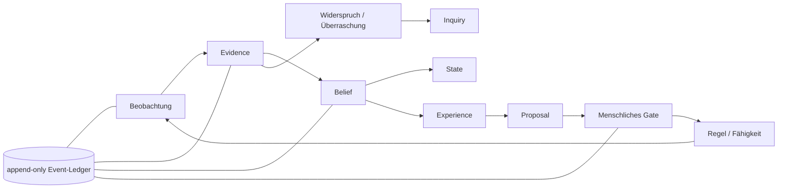

# GENUS

> Ein gläsernes Erkenntnissystem, das aus Erfahrung lernt, Unsicherheit ehrlich trägt
> und neue Fähigkeiten nur durch belegte, menschlich freigegebene Schritte verdient.

GENUS läuft als deterministischer Python-/SQLite-Kern auf einem Raspberry Pi. Das
Ledger hält fest, **was geschah**; Projektionen zeigen, **was GENUS daraus aktuell
glaubt**. Modelle, Netzwerk und Betriebssystemzugriffe leben in begrenzten Membranen
außerhalb des Wahrheitskerns.

## In zwei Minuten orientiert

| Ich möchte … | Hier entlang |
|---|---|
| das Zielbild verstehen | [Charter](docs/CHARTER.md) |
| den heutigen Stand sehen | [NOW](docs/NOW.md) |
| wissen, was als Nächstes kommt | [Roadmap](docs/ROADMAP.md) |
| den Kern technisch verstehen | [Architektur](docs/ARCHITECTURE.md) |
| Ereignisse und Pflichtfelder nachschlagen | [Event-Vertrag](docs/EVENT_CONTRACT.md) |
| Sicherheitsgrenzen prüfen | [Security-Modell](docs/SECURITY_MODEL.md) |
| auf dem Pi deployen oder diagnostizieren | [Pi-Runbook](deploy/README.md) |
| Abhängigkeiten und Wirkungen prüfen | [GENUS-Kartografie](docs/visual/GENUS_KARTOGRAFIE.html) · [maschinelle Daten](docs/generated/GENUS_KARTOGRAFIE.json) |
| stöbern und Entstehung sehen | [Dokumentationskarte](docs/README.md) · [historischer Visual Atlas](docs/visual/ATLAS.html) |

## Wie GENUS denkt



Die wichtigen Trennungen sind absichtlich hart:

- Beobachtung ist nicht Wahrheit.
- Belief ist nicht Tatsache.
- Inquiry ist nicht Handlung.
- Proposal ist nicht Entscheidung.
- Review ist nicht Aktivierung.
- Modelloutput ist Evidence, niemals Autorität.

## Kern und Membranen

| Deterministischer Kern (`genus/`) | Begrenzte Membranen (`deploy/`, Dienste) |
|---|---|
| Ledger, Replay, Projektionen | HTTP- und Datenquellen |
| Confidence, Beliefs, Inquiries | Telegram-Brücke |
| Inferenz und Graphregeln | lokale Modelle und Stimme |
| Governance und harte Constraints | systemd, Cron, Netzwerk-Recovery |
| keine LLM-/HTTP-/subprocess-Imports | dürfen den Kern füttern, nie ersetzen |

Eine benannte Quellbaum-Naht bleibt sichtbar: `genus/sensor.py` liest lokale
Systemwerte synchron über `psutil`. Der deterministische Wahrheits- und Replaypfad
beginnt beim gespeicherten Event; Netzwerk- und Modellbeschaffung bleibt in `deploy/`.

Die genaue Entscheidung steht in
[ADR-0001: Kern und Membranen](docs/decisions/ADR-0001-CORE-AND-MEMBRANES.md).

## Lokal loslegen

```powershell
python -m venv .venv
.\.venv\Scripts\python.exe -m pip install -e ".[dev]"
.\.venv\Scripts\python.exe -m pytest -q
```

Linux/Pi:

```bash
python3 -m venv .venv
.venv/bin/python -m pip install -e '.[dev]'
.venv/bin/python -m pytest -q
```

Für die folgenden Kurzbefehle aktiviere die Umgebung einmal mit
`.\.venv\Scripts\Activate.ps1` in PowerShell beziehungsweise
`source .venv/bin/activate` unter Linux. Ohne Aktivierung verwendest du den
jeweiligen vollständigen Pfad zur `genus`-Datei.

Ein **neuer** Ledger wird bewusst mit seiner ersten Beobachtung angelegt. PowerShell:

```powershell
New-Item -ItemType Directory -Force "$HOME\.genus" | Out-Null
$env:GENUS_DB_PATH = "$HOME\.genus\genus.sqlite3"
$env:GENUS_CORE_ID = "mein-kern"
.\.venv\Scripts\genus.exe observe-all
.\.venv\Scripts\genus.exe doctor
```

Linux/Pi:

```bash
mkdir -p "$HOME/.genus"
export GENUS_DB_PATH="$HOME/.genus/genus.sqlite3"
export GENUS_CORE_ID="mein-kern"
.venv/bin/genus observe-all
.venv/bin/genus doctor
```

Für einen **vorhandenen** Ledger setzt du nur `GENUS_DB_PATH` und rufst direkt
`doctor` auf. Diagnosebefehle erzeugen bei einem Tippfehler absichtlich keine Datenbank.

## Nützliche Türen

```bash
genus doctor                         # Gesundheit und Integrität
genus ask "was glaubst du"           # aus dem aktuellen Zustand antworten
genus beliefs show                   # Beliefs mit read-time Confidence
genus inquiries list                 # benannte Unsicherheit
genus knowledge                      # Wissensgraph und Strukturkonflikte
genus skills                         # Fähigkeits-Thermometer
genus betriebsprofil status          # private 24/48/72-Messreihe prüfen
genus kartografie check              # Modul-, Event-, Wirkungs- und Pi-Karte prüfen
genus replay                         # Projektionen deterministisch rekonstruieren
genus integrity check                # Verträge und Projektionen prüfen
genus ledger verify                  # Seal-Kette prüfen
genus why answer                     # Herkunft einer Antwort zeigen
```

Die vollständige CLI ist bewusst nicht nochmals als statische Liste dokumentiert:
`genus --help` und `genus <befehl> --help` sind die aktuelle Quelle.

## Qualitätsgate

```bash
python -m pytest -q
ruff check .
python -m compileall -q genus deploy tests
python -m pip check
pip-audit --local --skip-editable
bash -n deploy/*.sh
```

Eine Änderung ist erst vertrauenswürdig, wenn zusätzlich Replay, Integrität, Seal und
der beobachtete Betrieb stimmen. Siehe [Quality](docs/QUALITY.md) und
[ADR-0002: Change Trust](docs/decisions/ADR-0002-CHANGE-TRUST.md).

## Raspberry Pi

Der produktive Kern läuft unter dem normalen GENUS-Benutzer. Nur der kleine
Netzwerk-Watchdog und seine Reparaturhelfer liegen root-owned unter
`/usr/local/libexec/genus`. Produktdaten, Dienste und Deploypfad werden explizit
gepinnt; Root führt niemals Code direkt aus dem beschreibbaren Checkout aus.

Installation, Fast-Forward-Deploy, Cron, systemd und Recovery stehen im
[Pi-Runbook](deploy/README.md). Der aktuelle Betriebszustand steht in [NOW](docs/NOW.md).

## Dokumentationsprinzip

Jede Aussage hat genau einen autoritativen Wohnort. Historie bleibt erhalten, trägt
aber keinen gegenwärtigen Vertrag. Der vollständige Bibliotheksplan, Statusstufen und
Lesepfade stehen in [docs/README.md](docs/README.md).

---

**Kurz gesagt:** GENUS soll nicht möglichst viel behaupten. Es soll nachvollziehbar
lernen, wann es etwas weiß, wann es zweifeln muss und wie es den nächsten Schritt
verdient.
