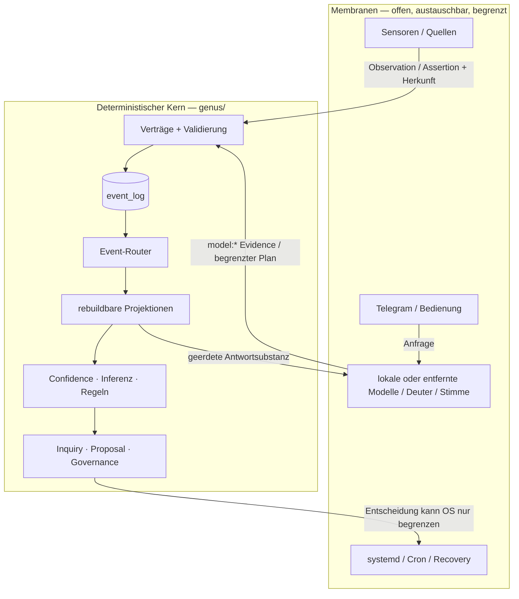

# GENUS Architecture

> **Status:** canonical
> **Owner:** Kernvertrag
> **Zuletzt verifiziert:** 2026-07-15
> **Besitzt:** Systemgrenzen, Schichten, Abhängigkeiten und technische Invarianten

## Ein Satz

GENUS ist ein synchroner, ledger-first Erkenntniskern: Er speichert unveränderlich,
**was geschah**, leitet deterministisch ab, **was er aktuell glaubt**, und hält Modelle,
Netzwerk sowie privilegierte Betriebshandlungen hinter expliziten Membranen.

## Systembild



## 1. Eine Wahrheit, viele Ansichten

### Event-Ledger

`event_log` ist die einzige dauerhafte Ereigniswahrheit. Ereignisse sind geordnet,
append-only und tragen Typ, Payload, Zeit sowie — nach Öffnung einer Seal-Epoche —
`prev_seal` und `seal`.

Ein Ereignis wird niemals umgeschrieben, um eine spätere Sicht „richtig aussehen“ zu
lassen. Revision, Supersession und Retraction sind neue Ereignisse.

### Projektionen

Beliefs, Relationsgraph, State, Inquiries, Experiences, Proposals, Governance,
Operationen, aktive Regeln sowie Antwort-Outcomes und explizite Feedbacklinks sind
Ansichten über das Ledger. Sie dürfen gelöscht und durch Replay rekonstruiert werden.

Eine Tabelle ist keine zweite Wahrheit, wenn ihr Inhalt vollständig aus dem Ledger
ableitbar ist und Replay dies testet.

### Read-time Ableitung

Confidence, Source Trust, Surprisal, Druck und ähnliche Bewertungen werden gelesen und
berechnet. Nicht jede sinnvolle Größe muss als Ereignis gespeichert werden. Gespeichert
wird nur, wenn die Berechnung selbst ein historisch relevantes Geschehen darstellt.

## 2. Epistemische Schichten

| Schicht | Bedeutung | Darf nicht verwechselt werden mit |
|---|---|---|
| Observation | gemessener oder empfangener Rohwert | Urteil |
| Evidence / Assertion | bequelltes Material | Wahrheit |
| Belief | aktuelle, revidierbare Lesart | Fakt |
| State | aus handlungsfähigen Beliefs abgeleiteter Gesamtzustand | gespeicherte Wahrheit |
| Inquiry | benannte offene Unsicherheit | Handlung |
| Experience | charakterisiertes Muster über Zeit | automatisch gültige Regel |
| Proposal | Vorschlag zur Veränderung | Entscheidung |
| Governance Decision | nachvollziehbare Freigabe/Ablehnung | Ausführung |
| Active Rule | bewusst aktivierte Erwartung | unregierte Heuristik |
| Operation | beobachteter Betriebsakt | Kernwahrheit über die Außenwelt |

Beliefs tragen epistemische Zustände wie `supported`, `contested` und `uncertain`.
Nur `supported` darf einen handlungsfähigen Systemzustand tragen. Widerspruch erzeugt
Sichtbarkeit, nicht Scheinsicherheit.

## 3. Event-Verarbeitung

Jeder reguläre fachliche Schreibpfad folgt derselben Form:

```text
Input → Vorbedingungen des Produzenten → Event append → Projektion anwenden → Commit
                                      ↘ nachgelagerter Integrity-Vertragscheck
```

`ledger.append()` ist dabei bewusst eine kleine Serialisierungs-, Insert- und
Siegelprimitive. Sie erzwingt **nicht zentral vor dem Schreiben** alle typabhängigen
Pflichtfelder. Dafür sind heute der jeweilige Produzent und der nachgelagerte
`integrity check` zuständig. Ein unvollständiges oder unbekanntes Event kann deshalb als
beschädigte Historie geschrieben werden und muss beim Integrity-Check beziehungsweise
Replay laut auffallen. Neue Produzenten müssen ihre Vorbedingungen vor dem Append prüfen;
der Event-Vertrag und seine Tests verhindern anschließend stille Drift.

Der Event-Router besitzt eine explizite Registry. Jeder Eventtyp ist entweder:

- **projiziert** — mit genau benanntem Projektor und persistiertem Ziel in
  `event_router.PROJEKTIONSZIELE`, oder
- **bewusst roh** — bleibt ausschließlich im Ledger.

Ein unbekannter Typ oder ein Typ ohne erklärte Route ist ein Fehler. Der vollständige,
maschinell gegengeprüfte Katalog steht in [EVENT_CONTRACT.md](EVENT_CONTRACT.md).

### Antwort- und Feedbackkreis (H1-Pilot)

Der erste H1-Vertikalschnitt hält Antwortsubstanz, Darstellung, Zustellung und Wirkung
auseinander:

```text
Read-Model → AnswerDraft → DialogueFrame + treuer Renderer → Telegram
                                                        ↓ gültiger Send/Edit-Beleg
                              response_outcome_recorded → Response-ID
                                                        ↓ eindeutiges Owner-Feedback
                              response_feedback_recorded
```

- `AnswerDraft` trägt für Definitionen und Beziehungen Claims, vorhandene Belege,
  Unsicherheit und einen unveränderten Fallback. `understood_unknown` darf keinen
  negativen Claim erfinden.
- `DialogueFrame` trägt Absicht, strukturelle Ankerkontinuität und den flüchtigen
  Darstellungsrahmen für genau eine Antwort — weder Frage noch vorige Antwort. Die
  Persönlichkeit bleibt kontrollierte Darstellung, kein Wahrheitsinput.
- Eine Response-ID entsteht erst nach einem gültigen Zustellbeleg und ist die Event-ID
  des `response_outcome_recorded`-Events. Erst danach wird der RAM-Session-Zug bestätigt.
- Outcome und Feedback sind datensparsame, replaybare Strukturprojektionen. Frage,
  Antwort, Slots, Telegram-`message_id`, Chat- und Nutzerkennung sind dort verboten.
- Als Feedback gelten nur reine 👍-/👎-Nachrichten und der enge Korrektur-Cue. Die
  Membran lässt als korrigierten Intent nur eine bekannte Raster-Absicht durch. Ein Modell
  darf allgemeines Lob oder Kritik nicht zur Qualitätsevidenz hochstufen. Feedback-Acks
  werden beim Rückbezug übersprungen; Ritual- und Fehlerantworten stoppen ihn.

Dieser Schnitt ist ein Pilot, kein abgeschlossenes H1: Die übrigen Handler liefern noch
fertige Strings, ein vollständiger Diskursplan und eine kuratierte Wirkungsbewertung fehlen.
Feedback verändert weder Modellgewichte noch Antwortstrategie automatisch. Die Response-ID
lebt an der Telegram-Kante nur in der RAM-Session; ein löschbarer Randindex für Neustarts
ist noch nicht gebaut. Auch für den schmalen Fehlerkorridor „Telegram zugestellt,
Outcome-Persistenz fehlgeschlagen“ gibt es noch keine Edge-Outbox; der Update-Offset wird
weitergeführt und diese Antwort bleibt ungemessen.

## 4. Wissensgraph und Relationsemantik

Relationen tragen mindestens Subjekt, Prädikat, Objekt, Quelle und Ableitung. Quellen
bleiben getrennt; Korroboration entsteht read-time.

Semantik ist explizit, nicht aus zufälliger Graphform geraten:

- ungerichtete Prädikate wie `verwandt` werden kanonisch orientiert,
- deterministische Produzenten dürfen exakt gleiche Kanten idempotent wiederholen,
- zählbare Beobachtungsprädikate bleiben echte Ereignisfolgen,
- Azyklizität gilt nur für die deklarierte Menge hierarchischer Prädikate,
- Transitivität allein bedeutet **nicht** Azyklizität,
- neue Hierarchiekanten werden gegen vollständige Erreichbarkeit geprüft,
- historische Konflikte werden iterativ als zyklische Komponenten mit Zeugenring erkannt.

Diese Trennung verhindert, dass eine legitime symmetrische Relation als Hierarchiefehler
behandelt wird.

## 5. Deuten, Registrieren, Lernen

Freie Eingabe wird außerhalb oder am Rand des Kerns gedeutet. Das Ergebnis ist kein
fertiger Befehl, sondern eine begrenzte Struktur, die gegen registrierte Werkzeuge,
Argumentformen und Constraints geprüft wird.

```text
freie Sprache → Deutungsvorschlag → Registry-/Fallprüfung → Kernwerkzeug → Event
```

Registries sind die wachsenden Flächen; die Regeln, nach denen etwas registriert werden
darf, gehören zum festen Boden. Lernen bedeutet nicht, Kernregeln heimlich zu ersetzen,
sondern Material neu zu lesen, Vorschläge zu erzeugen, zu testen und gegatet zu aktivieren.

Ein Feinblatt mit eigenem Werkzeug bildet eine semantische Grenze: Kann dieses Werkzeug den
konkreten Fall nicht lösen, darf der Dispatcher nicht auf eine gröbere Elternzelle ausweichen
und dort eine andere Frage beantworten. Der Eltern-Fallback gehört nur Blättern ohne eigenes
Werkzeug. Fehlende Pflichtslots werden in der erkannten Fähigkeit benannt.

### Lesbares Selbstbild

`genus/selbstbild.py` ist ein read-only Composer, keine zweite Identitätsdatenbank. Das
Rasterblatt `selbstbild` verbindet Fragen nach Identität und Habitat mit drei vorhandenen
Wahrheitsflächen:

| Facette | Quelle |
|---|---|
| Name und Version | laufender Code |
| Mission und Stand der Selbstbild-Fähigkeit | provenanzierter Zielgraph |
| Habitat | aktive Belief- und State-Projektionen |

Belegte, umstrittene und unsichere Habitat-Zustände bleiben getrennt. Hostname, physischer
Ort, Dienstetopologie oder andere nicht bequellte Details werden nicht aus der Laufzeit
geraten. Damit ändert sich die Selbstauskunft mit dem Systemzustand, ohne Doctor oder Sensoren
pro Chat neu auszuführen.

Der akzeptierte Wachstumsvertrag steht in
[ADR-0003](decisions/ADR-0003-GROWTH-LOOP.md).

## 6. Kern und Membranen

### Kern (`genus/`)

- SQLite, Ledger, Verträge und Replay
- Projektionen und read-time Bewertungen
- Inferenz und Relationsemantik
- Inquiries, Proposals, Governance und Constraints
- keine LLM-, HTTP-, Web- oder subprocess-Abhängigkeit

### Membranen (`deploy/`, Systemdienste)

- HTTP-/Netzwerkquellen
- Deuter, Embedder und Stimme
- Telegram-Brücke
- Cron, Backup, Status-Publish und Recovery
- systemd-Installation und privilegierter Watchdog

Die Quellbaumgrenze ist heute an einer Stelle bewusst nicht vollkommen geometrisch:
`genus/sensor.py` enthält synchrone lokale `psutil`-Leser für CPU, Speicher, Disk,
Aktivität und Temperatur. Sie greifen weder auf Netzwerk noch Modelle zu und liefern nur
Readings; der deterministische Wahrheits- und Replaypfad beginnt beim gespeicherten Event.
Externe Beschaffung bleibt vollständig unter `deploy/`. Diese benannte Naht darf nicht als
Vorbild für weitere Außenabhängigkeiten im Kern dienen.

Eine Membran darf fehlschlagen, ohne den Wahrheitsvertrag umzuschreiben. Ihr Output
trägt Quelle und wird so wenig vertraut, wie seine Herkunft verdient.

Die Telegram-Membran minimiert Gesprächsdaten vor dem Speichern: Journald erhält nur
Betriebsmetadaten; der Tagespuffer nur Zeit, erkannte Konzept-IDs, Lesarten und das boolesche
Warum-Folgesignal. Nachtrotation und Bot-Schreiber teilen einen Lock. Aus Themenhäufigkeit
entsteht keine persönliche Episode. Bis Nutzer-Namespaces existieren, spricht der persönliche
Kern nur mit genau einem Owner im Direktchat. Chat-abgeleitetes externes Wortlernen ist Opt-in.
Der genaue Speicher- und Abrufvertrag steht in
[design/MEMORY.md](design/MEMORY.md).

Eine ausdrücklich freigegebene zweite Datenschutzgrenze liegt vor GitHub Models: Erst wenn
lokale Rituale und Muster keinen sicheren Pfad finden, darf der Remote-Deuter den statischen
Segmentvertrag und ausschließlich den aktuellen, auf 1.000 Zeichen begrenzten Telegram-Text
sehen. Verlauf, Nutzerkennung, Ledger, Antwort und Korrekturdatei bleiben lokal. Sein Vorschlag
ist weder Antwort noch Evidenz: Herkunftsfilter, Rastergrenze und Kernzelle prüfen ihn erneut.
Die Freigabe ist eine widerrufbare `0600`-Datei; Minuten-/Tagesbudget und Circuit Breaker
begrenzen Kosten und Ausfälle.

## 7. Privileggrenze auf dem Pi

Produktdienste laufen als GENUS-Benutzer und sind auf dessen Home, Repo und Ledgerpfad
gepinnt. Root besitzt nur einen kleinen Betriebsrand:

- ausführbarer Watchdog und Reparaturhelfer unter `/usr/local/libexec/genus`,
- root-only StateDirectory,
- validierte, begrenzte Inputs aus dem Benutzerbereich,
- Journald statt privilegierter Append-Pfade,
- Ressourcen-, Task-, Capability- und `NoNewPrivileges`-Grenzen,
- GENUS darf eine Root-Recovery blockieren, aber niemals zusätzliche Root-Autorität
  erzeugen.

Details und Bedrohungsmodell: [SECURITY_MODEL.md](SECURITY_MODEL.md).

## 8. Change Trust

Eine Codeänderung ist zunächst eine Behauptung über GENUS. Vertrauen verdient sie durch:

1. Tests und statische Constraints,
2. Replay ohne neue Ledgerereignisse,
3. Integritäts- und Seal-Prüfung,
4. menschliche Freigabe bei wirkungsvollen Änderungen,
5. beobachtete Laufzeitevidenz.

Generatoren dürfen Entwürfe liefern, aber weder ihre eigene Abnahme definieren noch
Merge, Deploy oder Rootwirkung freischalten. Siehe
[ADR-0002](decisions/ADR-0002-CHANGE-TRUST.md).

## 9. Abhängigkeitsrichtung

Die grobe Richtung bleibt nach unten gerichtet:

```text
db / ledger / schema
        ↓
event contract / router / projections
        ↓
sources / beliefs / inquiries / experience
        ↓
inference / tools / governance / state
        ↓
CLI / companion-facing composition
        ↓
deploy membranes and services
```

Zyklen zwischen Fachmodulen sind ein Signal, gemeinsam genutzte Mechanik nach unten zu
ziehen oder eine Registry-/Vertragsgrenze einzuführen.

Die operationalisierte Abhängigkeitssicht wird nicht von Hand nachgezeichnet:
[GENUS-Kartografie](visual/GENUS_KARTOGRAFIE.html) und
[Maschinendaten](generated/GENUS_KARTOGRAFIE.json) werden aus dem rekursiven Python-AST,
dem SQL-Schema, Event-/Projektionsregistern und wenigen quellengebundenen Wirkungskanten
erzeugt. Python-Module und -Imports werden vollständig rekursiv gescannt; dynamisches SQL
wird als Analysegrenze ausgewiesen, wenn kein Tabellenziel belegbar ist. Shell-, systemd-
und Cronpfade sind quellengebundene Runtime-Verträge, kein vorgetäuschter vollständiger
Shell-AST. `genus kartografie check` verhindert Repo- und Artefaktdrift, verbindet sich aber
nicht live mit dem Pi. Eager und lazy Imports bleiben getrennt sichtbar; ein Laufzeitzyklus
ist ein Architekturhinweis, nicht automatisch ein Defekt.

## 10. Bewusste Grenzen

- SQLite ist ein Single-Writer-/Einzelknotenfundament, kein verteilter Konsens.
- Das Ledger wächst dauerhaft; Archivierung darf die belegte Historie nicht still brechen.
- Ein lokaler Seal schützt nicht gegen adaptives Neuversiegeln ohne externen Anchor.
- Föderation benötigt strukturell getrennte Kerne und ein Löschkonzept.
- Volltext-Episoden im heutigen append-only Ledger sind nicht physisch löschbar; ein echter
  persönlicher Memory-Vault mit Export, Retention und verifizierbarem Vergessen fehlt noch.
- Selbst-Codieren bleibt menschlich gemergt.
- Modelle verbessern Ausdruck und Deutung, nicht den Wahrheitsrang.

Aktuelle Betriebsgrenzen und Prioritäten gehören in [NOW.md](NOW.md), nicht in diesen
zeitlosen Vertrag.

## Dokumentfamilie

- Zweck und Grenzen: [CHARTER.md](CHARTER.md)
- Eventtypen: [EVENT_CONTRACT.md](EVENT_CONTRACT.md)
- Security: [SECURITY_MODEL.md](SECURITY_MODEL.md)
- Qualitätsgates: [QUALITY.md](QUALITY.md)
- heutiger Stand: [NOW.md](NOW.md)
- frühere Architekturbetrachtung: [history/TARGET_ARCHITECTURE_2026-07-04.md](history/TARGET_ARCHITECTURE_2026-07-04.md)
