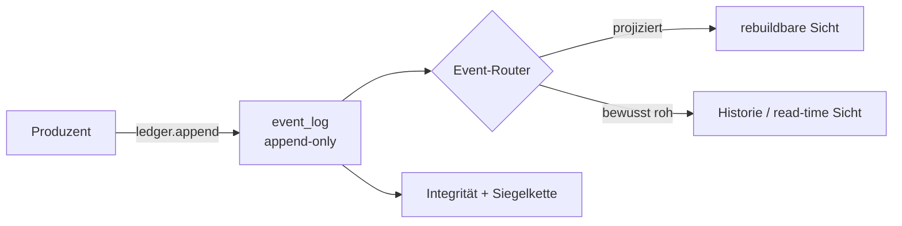

# GENUS Event-Vertrag

> **Status:** kanonisch · **Geltungsbereich:** `event_log`, Integritätsprüfung und Replay
> **Technische Autorität:** `genus.integrity.REQUIRED_EVENT_KEYS` und
> `genus.event_router` · **Drift-Schutz:** `tests/test_event_contract_docs.py`

Ein Event ist GENUS' unveränderliche Erinnerung daran, **was geschehen ist**.
Projektionen sind nur die daraus berechnete Gegenwart. Wer einen neuen Eventtyp
einführt, entscheidet deshalb immer zwei Dinge ausdrücklich:

1. Welche Felder machen das Ereignis prüfbar?
2. Welche Wirkung hat es beim Replay – oder warum bleibt es bewusst roh?

Diese Seite ist die schnelle Antwort auf beide Fragen. Die große Tabelle ist
absichtlich maschinenlesbar: CI vergleicht sie mit dem laufenden Kern.

## Der Weg eines Events

- **Projiziert** heißt: Der Router wendet das Event beim Replay auf eine
  abgeleitete Tabelle an.
- **Roh** heißt: Das Event bleibt absichtlich ohne persistierte Projektion. Es
  ist Auditspur, Rohmaterial oder wird bei Bedarf direkt aus dem Ledger gefaltet.
- Das Ledger bleibt in beiden Fällen die Wahrheit. Eine Projektion darf gelöscht
  und vollständig neu aufgebaut werden.

## Der vollständige Katalog

In „Pflichtfelder“ bedeutet *Pflicht* zunächst: Der Schlüssel muss im
JSON-Objekt vorkommen. Zusätzliche Werte- und Lebenszyklusregeln stehen im
darauffolgenden Abschnitt.

<!-- EVENT_SCHEMA:START -->
| Eventtyp | Pflichtfelder im Payload | Route | Wirkung beim Replay |
| --- | --- | --- | --- |
| `observation_created` | `raw_value`, `source`, `unit` | `raw` | Keine Projektion; unverarbeiteter Beobachtungsbeleg. |
| `evidence_recorded` | `metric_key`, `metric_value`, `observation_id` | `projected` | Schreibt den Messwert nach `value_projection`. |
| `assertion_recorded` | `claim_key`, `claim_value`, `derivation`, `source` | `projected` | Schreibt eine explizite Wertbehauptung nach `value_projection`. |
| `relation_asserted` | `derivation`, `object`, `predicate`, `source`, `subject` | `projected` | Fügt eine quellenbezogene Kante in `relation_projection` ein oder aktualisiert sie; symmetrische Prädikate werden kanonisiert. |
| `relation_retracted` | `object`, `predicate`, `reason`, `source`, `subject` | `projected` | Entfernt die passende Kante aus `relation_projection`. |
| `belief_created` | `belief_id`, `claim_key`, `claim_value`, `derivation`, `supporting_events` | `projected` | Legt einen aktiven Belief in `belief_projection` an. |
| `belief_confirmed` | `belief_id`, `new_supporting_event` | `projected` | Ergänzt den Belief um einen stützenden Beleg. |
| `belief_weakened` | `belief_id`, `contradicting_event` | `projected` | Ergänzt den Belief um einen widersprechenden Beleg. |
| `belief_superseded` | `claim_key`, `claim_value`, `derivation`, `new_belief_id`, `old_belief_id`, `reason`, `supporting_events` | `projected` | Legt den Nachfolger an und markiert den alten Belief als abgelöst. |
| `contradiction_detected` | `reason` | `raw` | Auditmarker; eine daraus entstehende Inquiry besitzt ihr eigenes Event. |
| `proposal_created` | `claim_key`, `claim_value`, `payload`, `proposal_id`, `proposal_type`, `reason`, `source_belief`, `source_event` | `projected` | Legt einen offenen Vorschlag in `proposal_log` an. |
| `proposal_reviewed` | `decision`, `note`, `proposal_id` | `projected` | Schließt den Vorschlag in `proposal_log` als angenommen oder abgelehnt. |
| `experience_recorded` | `derivation`, `experience_id`, `experience_key`, `experience_type`, `pattern`, `subject_key`, `summary`, `supporting_events` | `projected` | Legt eine Erfahrung in `experience_log` an. |
| `experience_recharacterized` | `experience_id`, `experience_key`, `pattern`, `reason`, `summary`, `supporting_events` | `projected` | Aktualisiert die Charakterisierung einer bestehenden Erfahrung. |
| `state_changed` | `components`, `derivation`, `previous_state_id`, `reason`, `state_id`, `state_key`, `state_value`, `supporting_beliefs` | `projected` | Legt den neuen Zustand in `state_projection` an und löst den vorherigen ab. |
| `rule_proposed` | `derivation`, `rule_key`, `rule_type`, `source_experience`, `spec`, `subject_key`, `summary` | `raw` | Reifungs- und Auditspur; der prüfbare Vorschlag läuft separat über `proposal_created`. |
| `rule_activated` | `derivation`, `rule_id`, `rule_key`, `rule_type`, `source_proposal`, `spec`, `subject_key` | `projected` | Legt die aktive Regel in `rule_projection` an. |
| `policy_evaluated` | `action`, `decision_id`, `policy_key`, `reason`, `result`, `target_id`, `target_type` | `raw` | Auditspur einer Policy-Prüfung. |
| `constraint_checked` | `action`, `constraint_key`, `decision_id`, `reason`, `result`, `target_id`, `target_type` | `raw` | Auditspur einer nicht übersteuerbaren Constraint-Prüfung. |
| `governance_decision` | `action`, `decision`, `decision_id`, `override`, `policy_results`, `reason`, `target_id`, `target_type` | `projected` | Legt die zusammengefasste Entscheidung in `governance_log` ab. |
| `operation_check_recorded` | `check_key`, `derivation`, `operation_id`, `payload`, `status`, `target` | `projected` | Legt einen Betriebscheck in `operation_log` ab. |
| `operation_recovery_attempted` | `action`, `check_key`, `derivation`, `failures`, `reason`, `recovery_id`, `target` | `projected` | Legt einen Wiederherstellungsversuch in `operation_log` an. |
| `operation_recovery_result` | `action`, `derivation`, `detail`, `recovery_id`, `result`, `target` | `projected` | Aktualisiert den Wiederherstellungsversuch um sein Ergebnis. |
| `inquiry_created` | `claim_key`, `inquiry_id`, `inquiry_type`, `payload`, `question_key`, `source_belief`, `source_event`, `state` | `projected` | Legt eine offene Frage in `inquiry_log` an. |
| `inquiry_resolved` | `answer`, `inquiry_id` | `projected` | Schließt genau eine Frage in `inquiry_log`. |
| `inquiries_reconciled` | `answer`, `inquiry_ids` | `projected` | Schließt einen mechanisch belegten Fragenstapel in `inquiry_log`. |
| `response_outcome_recorded` | `answer_mode`, `channel`, `feedback_eligible`, `outcome`, `readings` | `projected` | Legt genau eine nach Zustellbeleg bestätigte, inhaltsfreie Antwortwirkung in `response_outcome_log` an; ihre Event-ID ist die Response-ID. |
| `response_feedback_recorded` | `corrected_intent`, `response_id`, `signal`, `source` | `projected` | Verknüpft ein explizites Qualitätssignal replaybar mit einer feedbackfähigen Antwort in `response_feedback_log`. |
| `forecast_made` | `method`, `metric_key`, `predicted_value`, `support` | `raw` | Prognosebeleg; Auswertungen lesen ihn direkt aus dem Ledger. |
| `forecast_scored` | `actual_value`, `error`, `forecast_event`, `metric_key`, `predicted_value` | `raw` | Bewerteter Prognosebeleg; Lernkurven entstehen zur Lesezeit. |
| `ledger_epoch_opened` | `algo`, `genesis_digest`, `prefix_count`, `prefix_max_id` | `raw` | Keine fachliche Projektion; eröffnet die lokal versiegelte Ledger-Epoche. |
| `werkzeug_registriert` | `name`, `parameter`, `pruefbar_als`, `quelle`, `schreibt`, `wortlautfest` | `raw` | Auditspur einer Werkzeugentscheidung; die Laufzeit-Registry kommt aus Code. |
| `proposal_umgesetzt` | `art`, `ergebnis`, `proposal_id` | `raw` | Ausführungsspur; fachliche Wirkungen besitzen eigene projizierte Events. |
| `code_entwurf_erstellt` | `blatt`, `fingerabdruck`, `pfad`, `quelle` | `raw` | Werkstattspur eines erzeugten Codeentwurfs. |
| `code_entwurf_geprueft` | `bestanden`, `blatt`, `fingerabdruck`, `pfad`, `tests_exit`, `verbote` | `raw` | Werkstattspur der Prüfung eines Codeentwurfs. |
| `hand_vorgeschlagen` | `art`, `faellig_um`, `inhalt`, `quelle` | `raw` | Start einer Außenhandlung; ihr Zustand wird direkt aus `hand_*`-Events gefaltet. |
| `hand_bestaetigt` | `hand_id` | `raw` | Menschliche Freigabe einer vorgeschlagenen Außenhandlung. |
| `hand_ausgefuehrt` | `ergebnis`, `hand_id` | `raw` | Abschlussbeleg der genau-einmal ausgeführten Außenhandlung. |
| `hand_abgelehnt` | `hand_id` | `raw` | Menschliche Ablehnung einer vorgeschlagenen Außenhandlung. |
<!-- EVENT_SCHEMA:END -->

## Zusätzliche, hart geprüfte Bedingungen

Die folgenden Regeln werden von `integrity.validate_event_contract()` zusätzlich
zur bloßen Anwesenheit der Pflichtfelder erzwungen.

| Eventtyp oder Bereich | Zusätzliche Bedingung |
| --- | --- |
| Alle Events | `payload` ist gültiges JSON; der Eventtyp ist bekannt; Event-IDs bilden eine lückenlose Folge. |
| `belief_created`, `belief_superseded` | `derivation` ist nicht leer. |
| `contradiction_detected` | Zusätzlich zu `reason` ist **mindestens eines** von `belief_id` oder `claim_key` nicht leer. So ist sowohl Belief-vs-Evidence als auch Source-vs-Source verankerbar. |
| `experience_recorded` | `derivation` ist nicht leer. |
| `state_changed` | `derivation` ist nicht leer. |
| `rule_proposed` | `derivation` ist nicht leer. |
| `rule_activated` | `derivation` ist nicht leer; jeder `rule_key` darf im Ledger höchstens einmal aktiviert werden. |
| `constraint_checked` | `result` ist `pass` oder `violation`. |
| `policy_evaluated` | `result` ist `pass` oder `block`. |
| `governance_decision` | `decision` ist `allowed` oder `blocked`; `action` ist `proposal.review`, `rule.activate` oder `operation.recovery`; `target_type` ist `proposal` oder `operation_recovery`. |
| `operation_check_recorded` | `status` ist `ok` oder `fail`; `target` und `derivation` sind nicht leer. |
| `operation_recovery_attempted` | `action` ist `restart_network` oder `reboot`; `derivation` ist nicht leer. |
| `operation_recovery_result` | `result` ist `succeeded`, `failed` oder `scheduled`; `derivation` ist nicht leer. |
| `ledger_epoch_opened` | `algo` ist `sha256-chain-v1`; `genesis_digest` ist Text; `prefix_count` und `prefix_max_id` sind ganzzahlig interpretierbar und nicht negativ. |
| `proposal_reviewed` | `decision` ist `accepted` oder `rejected`; je `proposal_id` ist höchstens ein Review zulässig. |
| `inquiry_resolved` | `answer` ist nicht leer; je `inquiry_id` ist höchstens eine Auflösung zulässig. |
| `inquiries_reconciled` | `inquiry_ids` ist eine nicht leere Liste ohne Duplikate; `answer` ist nicht leer; bereits einzeln oder in einem früheren Stapel aufgelöste IDs dürfen nicht erneut aufgelöst werden. |
| `response_outcome_recorded` | Der Payload besitzt **exakt** die fünf Pflichtfelder, keine Inhalts- oder Transportfelder. `channel` ist `telegram`; `outcome` ist `answered`, `invalid_slots`, `understood_unknown` oder `fallback`; `answer_mode` ist `core`, `voice`, `edge_ritual`, `feedback_ack` oder `error`. `feedback_eligible` ist boolesch und bei Ack/Fehler immer falsch. `readings` enthält höchstens 32 eindeutige, strukturelle Intent-Tokens. |
| `response_feedback_recorded` | Der Payload besitzt **exakt** die vier Pflichtfelder. `response_id` verweist auf ein früheres feedbackfähiges Outcome; `signal` ist `positive`, `negative` oder `intent_correction`; `source` ist `owner_explicit`. `corrected_intent` ist nur beim Korrektursignal zulässig. |

Wichtig: Wo diese Tabelle keine weitere Form- oder Wertregel nennt, garantiert
die Integritätsprüfung derzeit **Schlüsselanwesenheit**, nicht automatisch Typ,
Nicht-Leerheit oder fachliche Plausibilität. Produzenten dürfen strengere
Vorbedingungen besitzen; diese sind dann Teil ihres Modulvertrags.

### Datenschutzgrenze des Antwortkreises

Der Outcome-Produzent läuft **nach** einem belegten Telegram-Send/Edit. Ein fehlender
oder ungültiger Zustellbeleg erzeugt weder Response-ID noch Session-Zug. Im Kern werden
nur Kanal, typisierte Wirkung, strukturelle Lesarten, Antwortmodus und
Feedback-Fähigkeit gespeichert. Frage, Antwort, Slots, Chat-/Nutzer-ID und Telegram-
`message_id` sind in diesen Payloads ausdrücklich verboten.

Explizites Feedback bedeutet im Pilot eine Nachricht, die — abgesehen von Leerraum und
Emoji-Varianten — vollständig aus 👍 oder vollständig aus 👎 besteht, einer kleinen exakten
Menge deutungsfreier Textkritik entspricht oder den engen Korrektur-Cue nutzt. Eine benannte
Warum-Frage gilt nur bei exakter Übereinstimmung mit dem strukturierten Anschlussangebot.
Beim Korrektur-Cue übernimmt die Telegram-Membran nur bekannte
Raster-Absichten; ein freier Nutzer-Token wird nicht ins Ledger geschrieben.
Modellgedeutetes allgemeines Lob oder Kritik wird nicht still zu Qualitätsevidenz
erhoben. Die Projektion macht Feedback messbar und replaybar; sie ändert keine
Antwortstrategie automatisch.

## Replay-Vertrag

`event_router.replay()` baut die Gegenwart deterministisch aus der vollständigen,
nach `id` sortierten Historie neu auf:

1. Es leert `response_feedback_log`, `response_outcome_log`, `rule_projection`,
   `governance_log`, `operation_log`, `inquiry_log`, `proposal_log`,
   `experience_log`, `state_projection`, `belief_projection`,
   `relation_projection` und `value_projection`. Feedback wird wegen seines
   Fremdschlüssels vor dem zugehörigen Outcome geleert.
2. Es setzt die zugehörigen SQLite-Sequenzen zurück.
3. Es führt jedes Event in Ledger-Reihenfolge durch `apply_event()`.
4. Der Router ergänzt nur für die Projektion die flüchtigen Felder `_event_id`
   und `_event_created_at`. Sie gehören **nicht** in den gespeicherten Payload.
5. Ein Event aus `PROJEKTOREN` ruft genau seinen registrierten Projektor auf. Ein
   Event aus `BEWUSST_ROH` verändert keine persistierte Projektion.

Der Live-Schreibpfad schreibt zuerst über `ledger.append()` und wendet die
jeweilige Projektion synchron im Produzenten an. Replay scannt keine Regeln,
Erfahrungen oder Inquiries neu und ruft keine Außenwelt auf: Es reproduziert nur
bereits belegte Entscheidungen.

Ein Integritätscheck vergleicht anschließend die live gelesenen Projektionen mit
einem frischen Replay in einer separaten In-Memory-Datenbank. Abweichung bedeutet
Projektionsdrift.

## Ledger- und Siegel-Invarianten

- `event_log` ist append-only: bestehende Events werden weder aktualisiert noch
  gelöscht.
- `event_type` ist nicht leer, `payload` ist JSON, und die Reihenfolge folgt der
  monotonen Event-ID.
- `prev_seal` und `seal` sind Append-Zeit-Felder. Historische Zeilen vor der
  Siegel-Epoche dürfen leer sein; versiegelte Zeilen müssen die lokale Kette
  verifizieren.
- `ledger_epoch_opened` bindet den unversiegelten historischen Präfix über seinen
  Genesis-Digest ein. Der Marker hat keine fachliche Projektionswirkung.
- Externe `genus-ledger-anchor-v1`-Artefakte sind **keine Events**. Sie schreiben
  nichts in `event_log` und bezeugen nur einen konkreten Ledger-Kopf.
- Confidence, epistemischer Zustand und gelernte Halbwertszeit werden zur
  Lesezeit berechnet. Sie sind keine Eventfelder und keine gespeicherte Wahrheit.

## Einen neuen Eventtyp sicher einführen

Die kurze Checkliste – wenn alle fünf Haken sitzen, bleibt der Kern rund:

- [ ] Der Produzent schreibt das Event mit `ledger.append()` und einem
  vollständigen, herkunftstragenden Payload.
- [ ] `REQUIRED_EVENT_KEYS` enthält den Typ und seine minimalen Pflichtfelder.
- [ ] Der Typ steht **genau einmal** im Router: als Projektor oder mit begründetem
  Eintrag in `BEWUSST_ROH`.
- [ ] Ein projizierter Typ registriert Projektor **und** persistierte Ziele atomar über
  `registriere_projektor(..., targets=...)`; jedes Ziel steht in Replay-Leerliste und
  Integritätssnapshot.
- [ ] Diese Katalogtabelle enthält exakt dieselben Pflichtfelder und die richtige
  Route; der Drift-Test ist grün.
- [ ] Für projizierte Events beweist ein Test: Snapshot vor Replay = Snapshot
  nach Replay. Für rohe Events beweist ein Test die beabsichtigte Read-time- oder
  Audit-Semantik.
