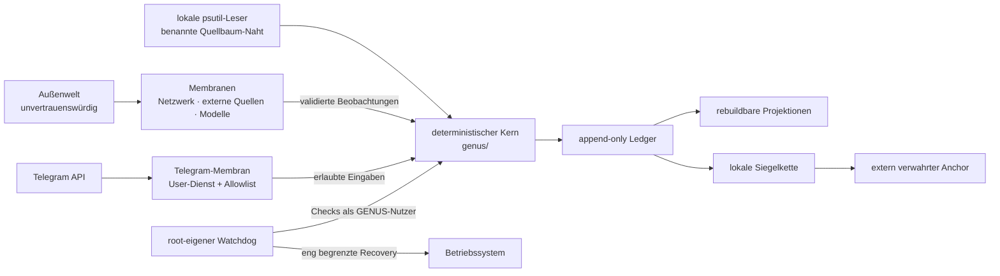

# GENUS Sicherheitsmodell

**Status:** kanonisch · **Zuletzt verifiziert:** 12. Juli 2026
**Owner:** Security- und Trust-Boundary-Vertrag
**Gilt für:** aktueller Stand von `main` und die produktive Raspberry-Pi-Installation

Dieses Dokument beschreibt, worauf GENUS vertraut, wo Privilegien wechseln und
welche Aussagen Ledger, Siegel und Anchor tatsächlich tragen. Praktische
Meldewege stehen in der [Security Policy](../SECURITY.md); der verifizierte
Ausgangszustand ist im [Härtungsaudit vom 12. Juli
2026](reports/2026-07-12-hardening-audit.md) festgehalten.

## Das Modell in einer Minute



Der Merksatz lautet:

> Außen darf gemessen und formuliert werden. Wissen entsteht erst als
> validiertes Ereignis im Kern. Root darf den Betrieb retten, aber keine neue
> Wahrheit erfinden. Ein Anchor bezeugt Vergangenheit – nicht Zukunft.

## Schutzziele

| Ziel | Mechanismus | Wichtige Grenze |
| --- | --- | --- |
| Herkunft | typisierte Events mit Payload und Zeitbezug | Ein wohlgeformtes Event kann inhaltlich trotzdem falsch sein. |
| Integrität | Append-only-Trigger, Event-Contract, Replay und Integrity-Check | Der Eigentümer der DB kann die lokale Schutztechnik grundsätzlich umgehen. |
| Manipulationserkennung | SHA-256-Siegelkette ab einer expliziten Epoche | Lokales Neusiegeln ist für sich allein nicht extern nachweisbar. |
| Externe Bezeugung | Offline-Anchor für `core_id`, Epoche und Seal-Head | Geschützt ist nur der Präfix bis zum Anchor-Head. |
| Least privilege | Kern und Langzeitdienste laufen als GENUS-Nutzer | Der Nutzer kontrolliert weiterhin seinen Checkout und seine Daten. |
| Begrenzte Root-Autorität | root-eigene Helper, root-eigener State, unabhängige Recovery-Gates | Root-Kompromittierung kann das Repository nicht verhindern. |
| Geheimhaltung | Token außerhalb von Git und Unit, restriktive Dateirechte | Ledger und lokale Hostdaten sind nicht automatisch verschlüsselt. |
| Verfügbarkeit | Timeouts, Output-, RAM-, Swap-, Task- und Restart-Grenzen | Kein Hochverfügbarkeits-Cluster; der Pi bleibt ein Einzelknoten. |

## Vertrauenszonen

### 1. Deterministischer Kern

Der Kern unter [`genus/`](../genus/) nimmt geformte Daten entgegen und erzeugt
geordnete Ereignisse und Projektionen. Produzenten prüfen ihre Vorbedingungen;
der zentrale Integrity-Check erkennt Pflichtfeld- und Routerverletzungen
nachgelagert. Die kleine Append-Primitive ist kein vollständiges Write-time-Gate.
Sein Architekturvertrag
verbietet eigene HTTP-/Socket-Aufrufe, Prozess-/Worker-Starts und Modell-SDKs.
[`test_membrane_purity.py`](../tests/test_membrane_purity.py) parst dafür die
Imports aller Python-Module und weist eine gepflegte Liste bekannter direkter
Netzwerk-, Prozess- und Modellimporte ab.

Dieses Gate ist bewusst keine Capability-Sandbox: dynamische Imports, Zugriffe
über allgemeine Standardbibliotheken und Threads sind nicht vollständig durch
die Denylist ausgeschlossen. Änderungen am Kern benötigen deshalb zusätzlich
Review; die Laufzeitisolation entsteht erst durch die jeweilige Dienstgrenze.

`genus/sensor.py` ist eine ausdrücklich benannte Ausnahme von der geometrischen
Quellbaumgrenze: Die dortigen synchronen `psutil`-Leser messen lokale CPU-, Speicher-,
Disk-, Aktivitäts- und Temperaturwerte. Sie öffnen weder Netzwerk noch Modelle und
gehören nicht zur Replaylogik. Der deterministische Wahrheitsvertrag beginnt beim
gespeicherten Event; neue Außenbeschaffung darf diese Naht nicht ausweiten.

Das bedeutet nicht, dass jede Aussage des Kerns automatisch wahr ist. Es
bedeutet, dass Herkunft und Zustandsübergang deterministisch prüfbar bleiben.
Beliefs können `supported`, `contested` oder `uncertain` sein; nur gestützte
Beliefs dürfen Systemzustand speisen. Vorschlag, menschliches Review,
Governance-Entscheidung und Ausführung sind getrennte Ereignisse.

### 2. Membranen

Shell-Skripte, netzwerkfähige Sensoradapter, Telegram und lokale Modellaufrufe liegen
unter [`deploy/`](../deploy/). Sie dürfen die Außenwelt berühren, sind aber keine
Wahrheitsinstanz. Netzwerkantworten, Modelltext, Dateiinhalte und
Benutzereingaben gelten als unvertrauenswürdig und müssen in die jeweiligen
Kernverträge übersetzt werden.

Eine kompromittierte Membran kann falsche Beobachtungen anbieten. Sie soll aber
weder direkt Projektionen umschreiben noch Root-Autorität erhalten. Herkunft,
Widersprüche und epistemischer Status begrenzen den Schaden auf sichtbare,
replaybare Behauptungen.

### 3. GENUS-Nutzer

Der produktive Login besitzt Checkout, virtuelle Umgebung, Ledger und
`~/.genus`. Learner und Telegram laufen mit dieser Identität. Auf dem
verifizierten Pi stuft der Watchdog seine GENUS-Unterbefehle mit vorhandenem
`runuser` auf dieselbe Identität herab. Installationsskripte verweigern eine
stillschweigende Auflösung auf `root`; eine abweichende Identität muss
ausdrücklich gewählt werden.

Kompromittiert jemand diesen Nutzer, kann er zukünftigen Code und zukünftige
Events beeinflussen sowie lokale Dateien verändern. Ein extern aufbewahrter
Anchor kann dann nur eine Umschreibung des bereits verankerten Präfixes
offenlegen. Er verhindert keinen bösartigen neuen Tail.

### 4. Root und Betriebssystem

Root wird nur für systemd-Verwaltung und Netzwerk-Recovery benötigt. Der
privilegierte Watchdog und seine Reparatur-Installer werden mit `root:root`
und Modus `0755` unter `/usr/local/libexec/genus` installiert. Root-State liegt
mit Modus `0700` unter `/var/lib/genus-network-watchdog`. Root führt niemals
den Watchdog aus dem nutzerbeschreibbaren Checkout aus.

Wenn der Watchdog den Kern befragt, wechselt er auf der produktiven
Installation mit `runuser` zum GENUS-Nutzer und begrenzt Laufzeit und Ausgabe.
Nutzerkontrollierte Marker werden ebenfalls als dieser Nutzer, als reguläre
Datei, ohne Symlink-Folgen und mit Größen-/Zeitlimit gelesen. Eine
GENUS-Entscheidung darf Recovery **verbieten**, aber Root-Autorität nicht
erweitern.

`runuser` ist dabei eine verbindliche Betriebsannahme. Der aktuelle Helper hat
für nicht privilegierte Direktaufrufe einen Fallback auf die aufrufende
Identität; in einer reduzierten Root-Umgebung ohne `runuser` wäre dieser
Fallback nicht fail-closed. Der Watchdog darf daher nur auf einem Host betrieben
werden, auf dem `runuser` vor Start vorhanden und geprüft ist. Das war auf dem
auditierten Pi der Fall; es ist keine portable Quellcodegarantie für beliebige
Linux-Images.

Ein Reboot erfordert zusätzlich zur GENUS-Entscheidung:

- einen realen fehlgeschlagenen Netztest;
- eine von Root auf 3 bis 12 Fehlschläge begrenzte Schwelle;
- einen mindestens einstündigen, root-eigenen Cooldown.

Damit bleibt die Sicherheitsentscheidung auch dann bei Root, wenn Nutzer-Code
oder Nutzer-State manipuliert wurde.

## systemd: drei verschiedene Rollen

| Unit | Identität | Aufgabe und Begrenzung |
| --- | --- | --- |
| `genus-network-watchdog` | Root, `oneshot` per 5-Minuten-Timer | Startet root-eigenen Helper; drei Minuten Unit-Timeout, privates `/tmp`, `UMask=0077`, root-eigener State. Prüft und repariert ausgewählte Identitäts- und Härtungsdrift. |
| `genus-learner` | GENUS-Nutzer | Kontinuierliches Lernen mit Idle-CPU/-IO und niedrigster Priorität. Nutzt explizite Home-, Repo-, Core- und DB-Pfade und schreibt ins Journal. Er besitzt keine Root-Rechte; seine Isolation ist bewusst nicht mit der Telegram-Sandbox gleichzusetzen. |
| `genus-telegram-bot` | GENUS-Nutzer | Netzwerk-Membran mit Restart-Grenzen, Single-Instance-Lock, Ressourcenlimits, leerem Capability-Set und systemd-Sandbox. |

Der Watchdog vergleicht eine sicherheitsrelevante **Teilmenge der effektiv
geladenen** Unit-Eigenschaften mit dem Sollzustand. Beim Learner sind das
Nutzer, Kernpfade und Journal-Ausgabe. Bei Telegram sind es Nutzer, DB-Pfad,
Allowlist, deaktivierte Zweitstimme, fehlendes `EnvironmentFile`, Journal,
`MemoryHigh`, `MemoryMax`, `MemorySwapMax`, `TasksMax` und
`NoNewPrivileges`. Reparaturen verwenden die root-eigenen Installer; erst die
später gestarteten Dienste führen den Checkout als unprivilegierter
GENUS-Nutzer aus.

Weitere im Installer gesetzte Eigenschaften – etwa Capability-Sets,
`PrivateDevices`, `ProtectSystem`, `RestrictAddressFamilies` und
`LimitNOFILE` – werden beim Installieren und in Tests geprüft, derzeit aber
nicht einzeln durch die periodische Live-Drifterkennung verglichen. Ein grüner
Watchdog-Tick ist deshalb kein vollständiges systemd-Unit-Audit.

Alle drei Units schreiben in das systemd-Journal. Das vermeidet privilegiertes
Öffnen nutzerkontrollierter Append-Pfade. Relevante Ausgaben werden mit
`journalctl -u <unit>` gelesen und müssen vor öffentlicher Weitergabe redigiert
werden. Die Telegram-Unit schreibt seit v1.17.0 nur Betriebsmetadaten: keinen
Nachrichtentext, keine Absender-ID und bei Fehlern nur die Exception-Klasse.

## Telegram-Grenze

Die Telegram-Membran in
[`telegram_bot.py`](../deploy/telegram_bot.py) spricht per HTTPS mit Telegram
und verarbeitet ausschließlich den einen numerisch allowlisteten Besitzer in
seinem privaten Direktchat. Gruppen werden auch dann abgewiesen, wenn der Besitzer
dort schreibt; mehrere Besitzer bleiben bis zu echtem Nutzer-Namespace/Föderation gesperrt.
Die Owner-ID wird beim Installieren streng validiert und ihr Wert direkt in die
root-eigene Unit geschrieben. PID 1 lädt **kein** nutzerkontrolliertes
`EnvironmentFile`.

Der Bot-Token:

- liegt ausschließlich in `~/.genus/telegram_bot_token` mit Modus `0600`;
- gehört nicht in Git, Logs, Ledger, Unit-Datei oder Dokumentation;
- sollte bevorzugt direkt auf dem Pi abgelegt und nicht als Kommandozeilenargument
  übergeben werden.

Die Allowlist ist ein Autorisierungsmerkmal, kein kryptografisches Secret. Sie
ist dennoch persönliche Betriebsmetadaten und wird nicht veröffentlicht.

Der Tagespuffer unter `~/.genus/chat_tag.jsonl` enthält nur Zeit, erkannte
Konzept-IDs, Lesarten und ein boolesches Warum-Folgesignal. Frage und Antwort
werden nicht dupliziert. Bot und Nachtrotation teilen einen Lock; die Nacht
rotiert per atomarem Rename statt nachträglich zu truncaten. Historische
Journale oder Legacy-Logs können noch Rohtext aus älteren Versionen enthalten
und werden bei einem Deploy nicht still gelöscht.

`~/.genus/korrekturen.jsonl` ist die ausdrückliche, begrenzte Rohtext-Ausnahme: höchstens 50
korrigierte vorherige Fragen, `0600`, ohne Alters-TTL. Automatisches Chat-Wortlernen ist
standardmäßig aus. Erst `GENUS_CHAT_WORD_LEARNING=1` erlaubt, unbekannte einzelne Wortformen
in `lernwunsch.txt` zu puffern und an externe Lexikonquellen zu senden; der Learner redigiert
die Wortform in seinen Logs. Beide Dateien bleiben löschbare Membran-Daten, nicht geheime
Ledger-Nebenkanäle.

Die Unit begrenzt den Bot auf `MemoryHigh=2500M`, `MemoryMax=3G`,
`MemorySwapMax=512M`, `TasksMax=64` und `LimitNOFILE=256`. Unter anderem sind
`NoNewPrivileges`, privates `/tmp`, private Geräte, schreibgeschütztes
System, unsichtbare fremde Prozesse, native Systemaufrufe und ausschließlich
Unix-/IPv4-/IPv6-Adressfamilien aktiv. Capability- und Ambient-Capability-Sets
sind leer. Eine zweite Modellstimme ist standardmäßig deaktiviert, damit ein
Fehlschalter nicht zwei große Modelle dauerhaft in den Pi lädt.

Diese Maßnahmen begrenzen Prozess- und Hostschaden. Sie machen Telegram, das
Internet oder Modelltext nicht vertrauenswürdig und bieten keinen Schutz gegen
einen bereits kompromittierten GENUS-Nutzer.

## Ledger, Siegel und Anchor

### Ledger

`event_log` ist die Quelle der Historie. SQLite-Trigger verhindern in normalen
Pfaden `UPDATE` und `DELETE`. Projektionen werden beim Replay geleert und aus
Events wieder aufgebaut; [`integrity.py`](../genus/integrity.py) prüft Schema,
Event-Contract, Siegelkette und Replay-Stabilität. Schreibende Prozesse holen
vor dem Lesen des Seal-Heads mit `BEGIN IMMEDIATE` den SQLite-Schreiblock, damit
parallele Membranen keine zwei gültig aussehenden Nachfolger desselben Heads
erzeugen.

Append-only ist eine Anwendungs- und Datenbankinvariante, kein Schutz gegen den
Dateieigentümer oder Root. Außerdem beweist ein sauberer Replay nur, dass
Historie und Projektionen zusammenpassen – nicht, dass jede Beobachtung wahr
war.

### Lokale Siegelkette

[`sealing.py`](../genus/sealing.py) eröffnet mit `ledger_epoch_opened` eine
explizite Epoche. Dieses Event bindet den unveränderten Legacy-Präfix über einen
Genesis-Digest. Ab dort enthält jedes neue Event `prev_seal` und `seal`; Inhalt
und Reihenfolge fließen in eine SHA-256-Kette ein.

Die Kette erkennt versehentliche Korruption und Änderungen, die nicht passend
neu versiegelt wurden. Ein lokaler Angreifer mit DB-Schreibrecht kann jedoch
Trigger entfernen, Events ändern und die Kette neu berechnen. Der vorhandene
`reseal`-Befehl ist deshalb eine bewusste Wartungsoperation: Er setzt die
Manipulationserkennung über den betroffenen Abschnitt zurück und darf erst nach
Beweissicherung, dokumentierter Entscheidung und anschließender externer
Neu-Verankerung eingesetzt werden.

### Offline-Anchor

[`anchor.py`](../genus/anchor.py) exportiert ein kanonisches JSON-Artefakt, das
`core_id`, Epoche, Head-Event und Head-Seal bindet, ohne selbst ein Ledger-Event
zu schreiben. Eine unveränderbar oder außerhalb des Pi verwahrte Kopie erkennt
auch adaptives Neusiegeln und Tail-Kürzung **bis zu genau diesem Head**.

Ein Anchor:

- schützt keine Events nach seinem Head;
- verhindert keine Manipulation, sondern macht sie prüfbar;
- ist in der aktuellen Version nicht signiert und gewinnt seine Stärke erst
  durch die unabhängige, geschützte Aufbewahrung;
- schützt weder Vertraulichkeit noch Verfügbarkeit.

Die Anchor-Kadenz ist damit ein echter Sicherheitsparameter: Sie bestimmt die
maximale Länge des lokal unbezeugten Tails.

## Streu-Datenbanken

Eine Streu-Datenbank ist eine SQLite-Datei, die durch einen falschen Nutzer,
ein falsches Home oder fehlendes `GENUS_DB_PATH` neben dem Produkt-Ledger
entsteht. Sie kann intern konsistent sein und trotzdem nicht zur kanonischen
Historie gehören.

Die aktuelle Abwehr besteht aus mehreren Schichten:

- Produktive Units setzen Nutzer, Home und DB-Pfad ausdrücklich; Jobs, die eine
  Core-ID benötigen, erhalten auch diese aus der festgelegten Quelle.
- Installer prüfen Schreibbarkeit als GENUS-Nutzer und verweigern implizites
  Root-Home.
- Read-only-Diagnostik öffnet ausschließlich eine vorhandene Datei mit SQLite
  `mode=ro` und erzeugt bei einem Tippfehler keine neue DB.
- Das private Betriebsprofil verwendet dieselbe Verbindung, bildet Intervalle nur über
  Head-IDs und persistiert weder Payloads noch freie Quellen-, Entitäts- oder Pfadwerte.
  Folgepunkte verlangen dieselbe DB-Datei, einen monotonen Head und denselben vollständigen
  Hash aller Zeilenfelder im Ledger-Präfix; lokale Snapshot-Hashes sind dabei
  Korruptionsdetektoren, keine externen Anker.
- Ein normaler neuer Schreibpfad meldet die Anlage einer DB unübersehbar auf
  `stderr`.
- Der Root-Watchdog erkennt die historische Root-Streuadresse und lässt sie
  für ein Audit unangetastet, statt sie automatisch zu vermischen oder zu
  löschen.

Eine Streu-DB wird **niemals blind gemerged**. Sichere Behandlung:

1. Alle beteiligten Writer stoppen und DB samt WAL unverändert sichern.
2. Pfad, Eigentümer, Größe, Hash und offene Handles dokumentieren.
3. SQLite und Event-Contract read-only prüfen.
4. Ereignisse semantisch gegen das Produkt-Ledger vergleichen; gleiche IDs
   oder gleiche Zeilenzahlen sind kein Herkunftsbeweis.
5. Das Artefakt gehasht und nur für Root zugänglich quarantänisieren.
6. Eine selektive Übernahme als neue, belegte Produkt-Events separat prüfen.

Das historische Pi-Artefakt wurde nach diesem Muster auditiert und ohne Merge
quarantänisiert; Details stehen im [Härtungsaudit](reports/2026-07-12-hardening-audit.md).

## Bedrohungen und erwartetes Verhalten

| Bedrohung | Erwartete Abwehr | Verbleibendes Risiko |
| --- | --- | --- |
| Versehentliches Event-Update/-Delete | SQLite-Trigger und Integrity-Check schlagen an. | Direkter Dateischaden kann Verfügbarkeit kosten. |
| Parallel schreibende Membranen | WAL, Busy-Timeout und früher Schreiblock serialisieren den Seal-Head. | Ein Prozessabbruch kann normale SQLite-Recovery erfordern. |
| Manipulierte Netzwerk-/Modellantwort | Membranvalidierung, Herkunft und epistemischer Status verhindern automatische Wahrheit. | Plausible Falschdaten können als falsche Beobachtung im Ledger landen. |
| Kompromittierter Telegram-Absender | Allowlist verwirft nicht autorisierte IDs. | Telegram-Kontoübernahme einer erlaubten Identität liegt außerhalb des Pi. |
| Kompromittierte Telegram-Membran | Unprivilegierter Nutzer, Sandbox, leere Capabilities und Ressourcenlimits begrenzen Schaden. | Zugriff auf Nutzer-Ledger und Token bleibt innerhalb dieser Zone möglich. |
| Gesprächsdaten in Betriebslogs | Telegram protokolliert nur Betriebsmetadaten, insbesondere Länge/Fehlerklasse; Tagespuffer ist rohtextfrei und `0600`. | Historische Logs vor v1.17.0 und begrenzte Korrekturdateien können Rohtext enthalten; bewusste Retention/Löschung steht aus. |
| Persönliche Antwort in einem Gruppenchat | Bot akzeptiert nur den Owner-Direktchat; genau eine Owner-ID ist zulässig. | Echte Gruppenräume brauchen getrennte Speicher- und Berechtigungsnamespaces. |
| Chat-Wort wird extern nachgeschlagen | Standardmäßig deaktiviert; Opt-in, Queue/Lock `0600`, Logs ohne Wortform. | Bei Opt-in sieht der externe Lexikonanbieter die Wortform und das erworbene Wissen bleibt im Ledger. |
| „Vergessen“ einer persönlichen Episode | Retraktion entfernt die aktive Graphsicht. | Volltext bleibt heute im append-only Ledger und in Backups; echter löschbarer Memory-Vault fehlt. |
| Manipulierter Nutzer-Checkout | Root startet keinen privilegierten Code daraus; Kernaufrufe erfolgen als Nutzer. | Nutzer-Dienste führen den Checkout erwartungsgemäß als derselbe Nutzer aus. |
| Manipulierter Nutzer-State fordert Reboot | Root verlangt eigenen Netzfehler, Schwelle und Cooldown; GENUS kann nur vetoieren. | Root-/Kernel-Kompromittierung umgeht diese Logik. |
| Adaptive lokale Ledger-Umschreibung | Extern verwahrter Anchor erkennt Änderungen bis zum Head. | Unverankerter Tail und zukünftige Events bleiben lokal kontrollierbar. |
| Beschädigtes oder vertauschtes Betriebsprofil/Ledger | Private reguläre Dateien, Snapshot-SHA-256, feste Manifeststruktur, exklusiver Lock sowie DB-Datei- und Head-Kontinuitätsprüfung schließen die Messreihe. | Lokale Profil-Hashes erkennen Korruption, sind ohne externen Anchor aber kein Beweis gegen einen vollständig kontrollierenden Nutzer. |
| Falscher DB-Pfad | explizite Unit-Identität, Drift-Reparatur, read-only Diagnose und Warnung bei Neuanlage | Manuell gestartete Schreibbefehle können nach bestätigter Warnung weiterhin eine neue DB anlegen. |

## Betriebschecks

Die folgenden Checks schreiben keine neue Wahrheit in das Ledger:

```bash
genus doctor
genus integrity check
genus ledger verify
genus ledger anchor verify <extern-verwahrter-anchor.json>
command -v runuser
systemctl --failed
systemctl show genus-learner.service -p User -p Environment -p StandardOutput -p StandardError
systemctl show genus-telegram-bot.service -p User -p EnvironmentFiles -p MemoryMax -p MemorySwapMax -p TasksMax -p NoNewPrivileges
journalctl -u genus-network-watchdog.service --since today
```

Vor dem Teilen der Ausgabe immer Pfade, Nutzerkennungen, Core-ID, Telegram-
Metadaten und sonstige Hostdetails redigieren. Datierte interne Auditberichte
verwenden dafür ebenfalls Platzhalter.

## Incident-Runbooks

### Siegel oder Replay schlägt fehl

1. Writer stoppen; DB, `-wal` und `-shm` kopieren und hashen.
2. Letzten externen Anchor und dessen ursprünglichen Speicherort sichern.
3. Integrity, Seal-Verify und Anchor-Verify gegen eine Arbeitskopie ausführen.
4. Erst danach Ursache und Wiederherstellung entscheiden. Nicht vorschnell
   `reseal` ausführen.
5. Jede bewusste Reparatur dokumentieren und einen neuen externen Anchor
   erzeugen.

### Telegram-Token könnte offengelegt sein

1. Dienst stoppen und Token beim Provider widerrufen/rotieren.
2. Neuen Token direkt in die Token-Datei schreiben und Modus `0600` prüfen.
3. Dienst neu starten; Journal auf versehentliche Offenlegung prüfen und
   Beweismittel nicht öffentlich teilen.

### systemd- oder Root-Drift

1. Effektive Unit-Eigenschaften mit `systemctl show` erfassen.
2. Root-Helper, Unit-Dateien und Checkout-Commit getrennt hashen bzw. notieren.
3. Nur aus einem geprüften Commit über die Installer neu ausrollen.
4. Einen weiteren Watchdog-Tick und anschließend alle effektiven Eigenschaften
   prüfen.

## Nicht durch dieses Repository gelöst

- Festplattenverschlüsselung, Secure Boot und physischer Zugriff auf den Pi;
- Schutz gegen vollständige Root-/Kernel-Kompromittierung;
- Hochverfügbarkeit und automatischer Ersatz eines ausgefallenen Pi;
- Vertraulichkeit gegenüber dem lokalen GENUS-Nutzer;
- Vertrauenswürdigkeit von Telegram, Netzwerkprovidern, Modellgewichten oder
  externen Datenquellen;
- physische Löschung bereits im append-only Ledger gespeicherter persönlicher
  Episoden; dafür braucht GENUS einen getrennten Memory-Vault mit Export- und
  Retention-Vertrag;
- externe, signierte Zeitstempelung der Anchor-Artefakte.

Diese Grenzen sind keine Ausrede, sondern Teil der Sicherheitsgarantie: GENUS
soll genau sagen können, was es weiß – und ebenso genau, was seine Schutztechnik
nicht beweist.
